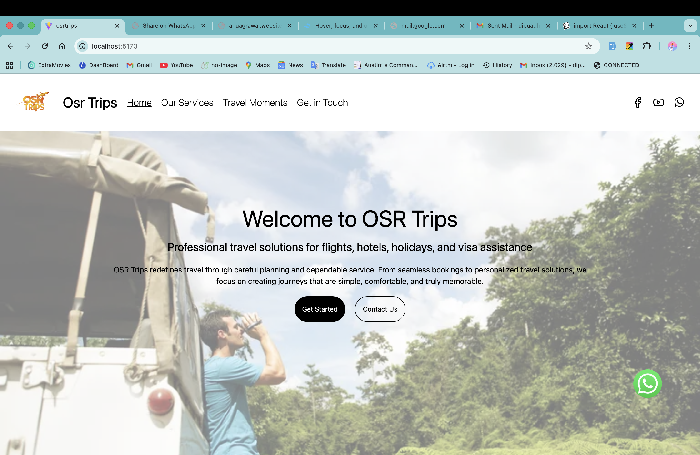
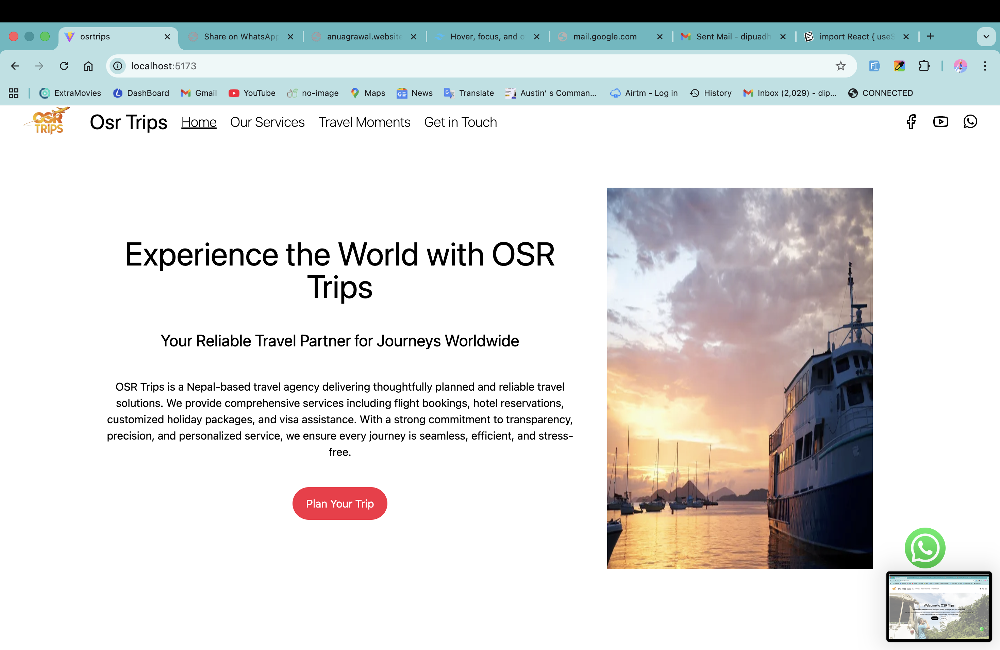
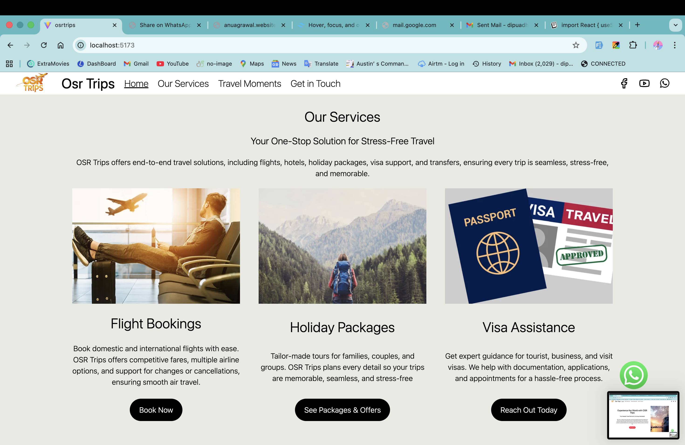
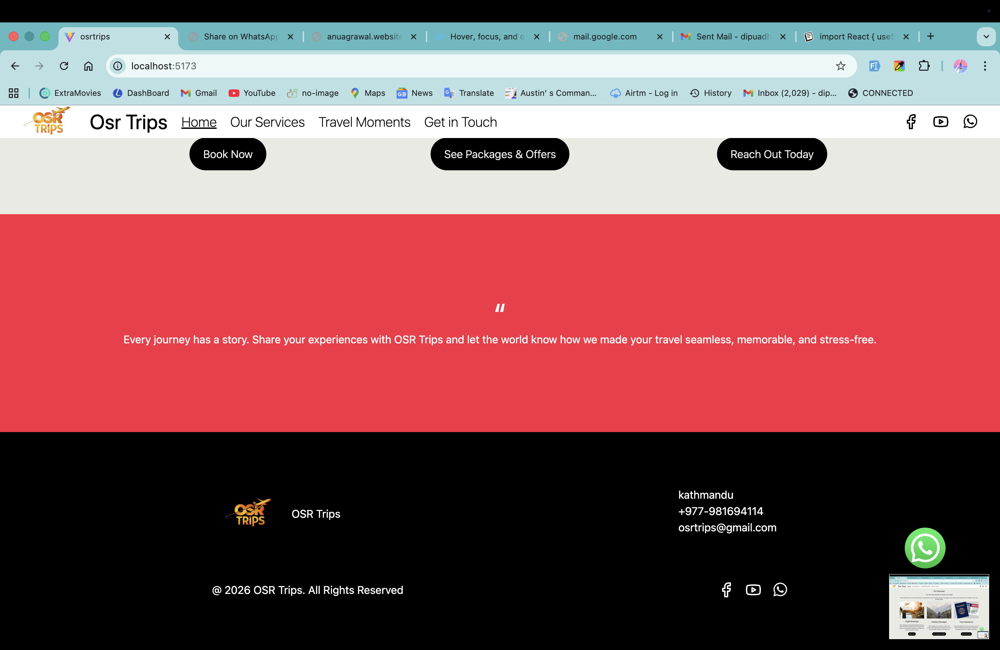
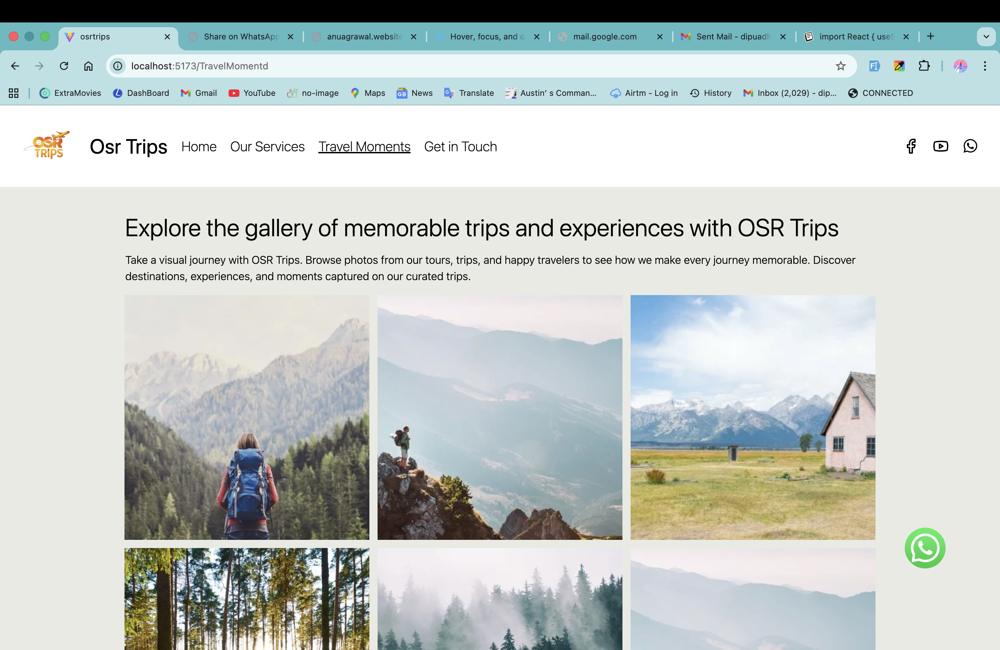
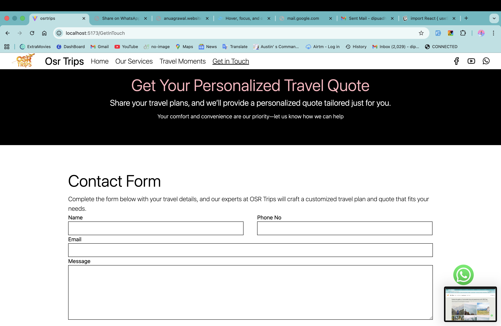
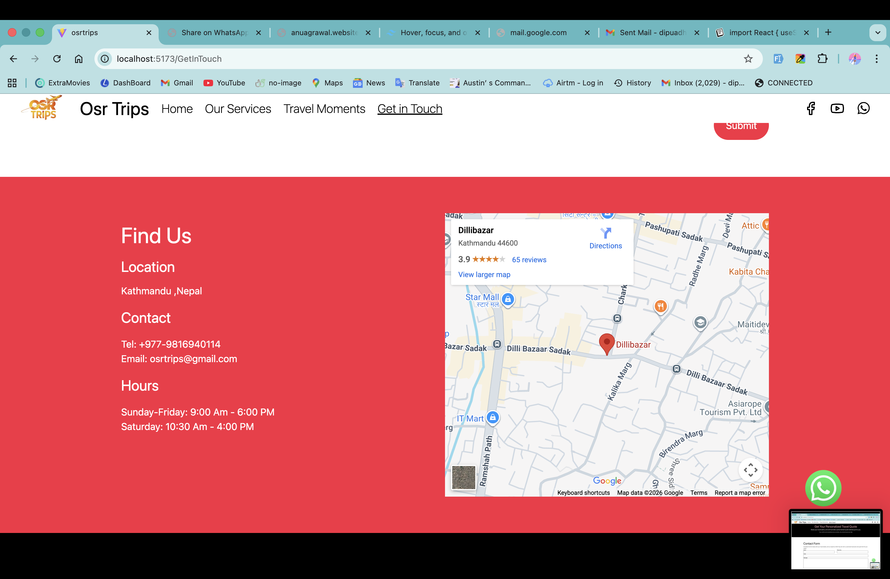

# Osr Trips Website

This is a responsive travel website built using **React**. The website showcases travel services, travel moments, and provides a way for users to get in touch with the company.  

---

## Features

- Design using Tailwind CSS.
- Social media links (Facebook, YouTube, WhatsApp).
- Floating WhatsApp contact button.
- Multiple pages:  
  - Home  
  - Our Services  
  - Travel Moments  
  - Get in Touch  

---

## Screenshots








---

## Installation

1. Clone the repository:
   ```bash
   git clone <your-repo-link>